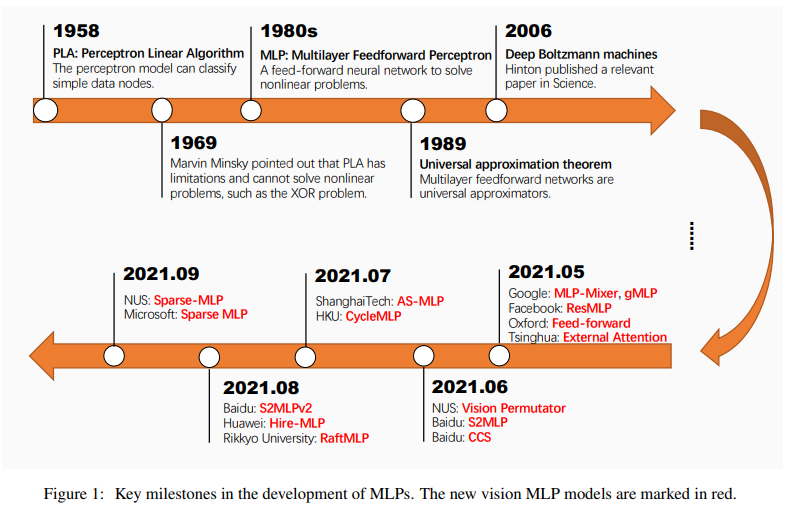

# Mixer Models

MLP Mixer related to Models (for archiving purpose)

</img>

# Models (To Be) Reviewed

1. MLP-Mixer
2. Res-MLP
3. S2-MLP
4. Sparse-MLP 
5. Swin-MLP

# Citations
```bibtex
@article{liu2021we,
  title={Are we ready for a new paradigm shift? A Survey on Visual Deep MLP},
  author={Liu, Ruiyang and Li, Yinghui and Liang, Dun and Tao, Linmi and Hu, Shimin and Zheng, Hai-Tao},
  journal={arXiv preprint arXiv:2111.04060},
  year={2021}
}
```