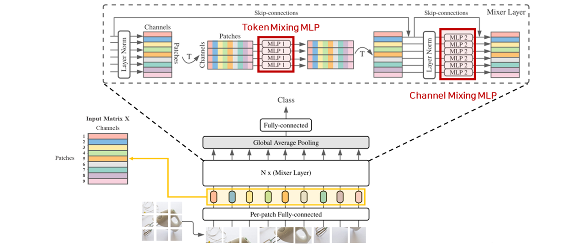

</img>

## MLP Mixer (Pytorch)

MLP-Mixer : An all Architecture for Vision (<a href="https://arxiv.org/abs/2105.01601"> Link </a>)

## Paper Review
Euisuk Chung's Paper Review (<a href="https://youtu.be/Y-isY31Thkw"> Video </a>)


## Code Source
This code is from `lucidrains` github `mlp-mixer-pytorch`

<a href="https://github.com/lucidrains/mlp-mixer-pytorch">lucidrains/mlp-mixer-pytorch</a>

## Citations

```bibtex
@misc{tolstikhin2021mlpmixer,
    title   = {MLP-Mixer: An all-MLP Architecture for Vision},
    author  = {Ilya Tolstikhin and Neil Houlsby and Alexander Kolesnikov and Lucas Beyer and Xiaohua Zhai and Thomas Unterthiner and Jessica Yung and Daniel Keysers and Jakob Uszkoreit and Mario Lucic and Alexey Dosovitskiy},
    year    = {2021},
    eprint  = {2105.01601},
    archivePrefix = {arXiv},
    primaryClass = {cs.CV}
}
```
