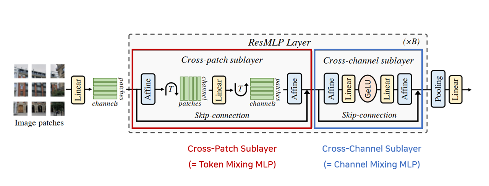

</img>

## MLP Mixer (Pytorch)

ResMLP: Feedforward networks for image classification with data-efficient training (<a href="https://arxiv.org/abs/2105.03404"> Link </a>)

## Paper Review
Euisuk Chung's Paper Review (<a href="https://youtu.be/o13XUvgH9ug"> Video </a>)


## Code Source
This code is from `liuruiyang98` github `Jittor-MLP`

<a href="https://github.com/liuruiyang98/Jittor-MLP">liuruiyang98/Jittor-MLP</a>

## Citations

```bibtex
@article{touvron2021resmlp,
  title={Resmlp: Feedforward networks for image classification with data-efficient training},
  author={Touvron, Hugo and Bojanowski, Piotr and Caron, Mathilde and Cord, Matthieu and El-Nouby, Alaaeldin and Grave, Edouard and Izacard, Gautier and Joulin, Armand and Synnaeve, Gabriel and Verbeek, Jakob and others},
  journal={arXiv preprint arXiv:2105.03404},
  year={2021}
}
```
