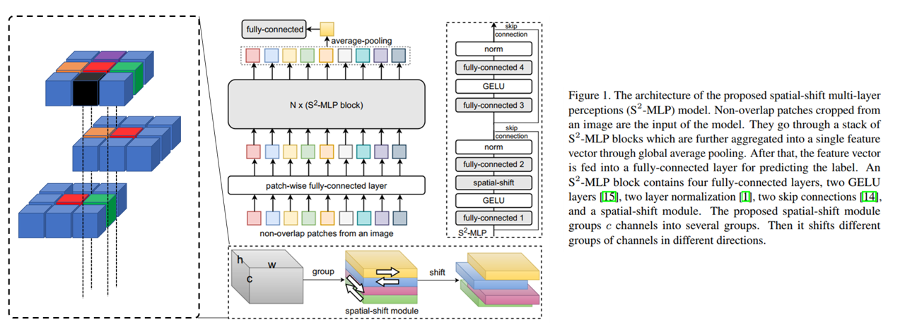

## S2-MLP (Pytorch)

S2-MLP : Spatial-shift mlp architecture for vision (<a href="https://arxiv.org/abs/2105.03404"> Link </a>)

</img>

## Paper Review
Euisuk Chung's Paper Review (To Be Updated)

## Code Source
This code is from `liuruiyang98` github `Jittor-MLP`

<a href="https://github.com/liuruiyang98/Jittor-MLP">liuruiyang98/Jittor-MLP</a>

## Citations

```bibtex
@inproceedings{yu2022s2,
  title={S2-mlp: Spatial-shift mlp architecture for vision},
  author={Yu, Tan and Li, Xu and Cai, Yunfeng and Sun, Mingming and Li, Ping},
  booktitle={Proceedings of the IEEE/CVF Winter Conference on Applications of Computer Vision},
  pages={297--306},
  year={2022}
}
```
