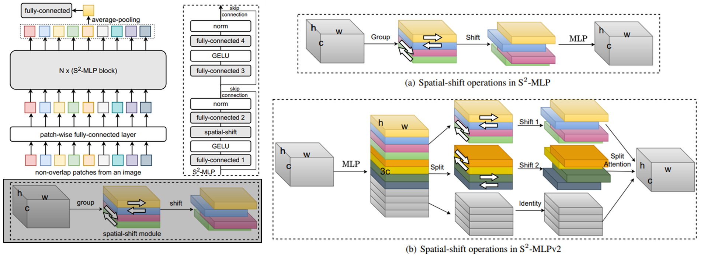

## S2-MLP Version 2 (Pytorch)

S2-MLPv2 : Improved Spatial-Shift MLP Architecture for Vision (<a href="https://arxiv.org/abs/2108.01072"> Link </a>)

</img>

## Paper Review
Euisuk Chung's Paper Review (To Be Updated)

## Code Source
This code is from `liuruiyang98` github `Jittor-MLP`

<a href="https://github.com/liuruiyang98/Jittor-MLP">liuruiyang98/Jittor-MLP</a>

## Citations

```bibtex
@article{yu2021s,
  title={S $\^{} 2$-MLPv2: Improved Spatial-Shift MLP Architecture for Vision},
  author={Yu, Tan and Li, Xu and Cai, Yunfeng and Sun, Mingming and Li, Ping},
  journal={arXiv preprint arXiv:2108.01072},
  year={2021}
}
```
